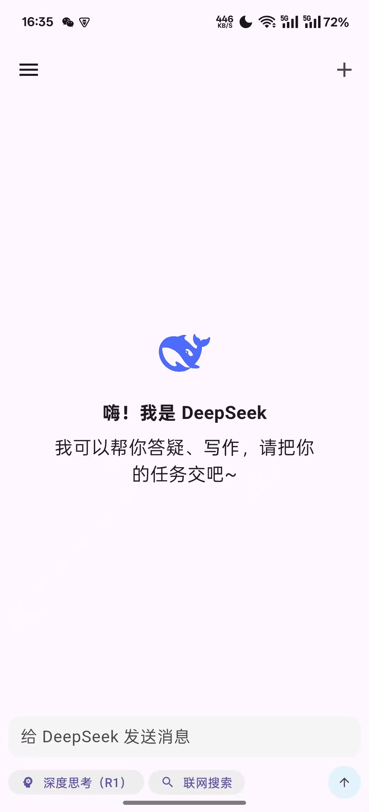
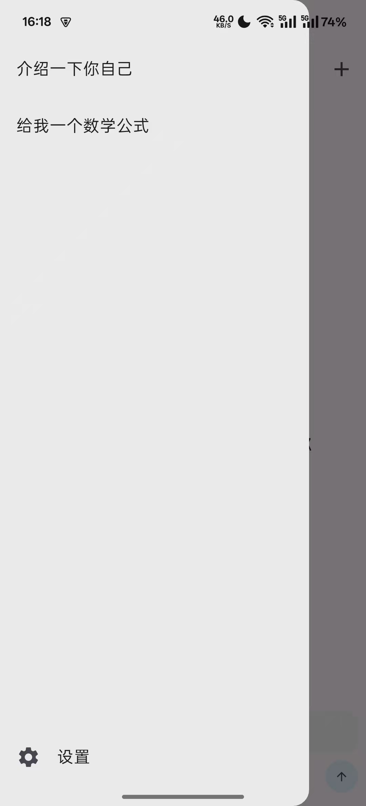
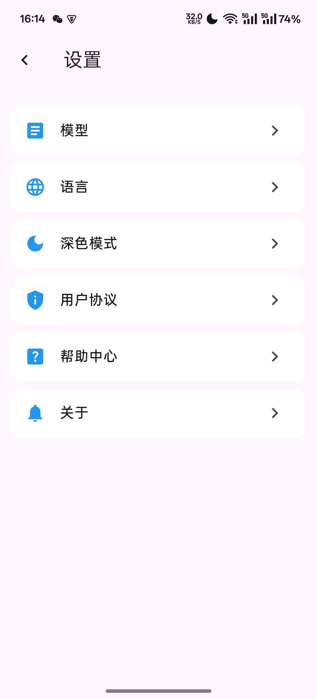

# DeepSeek Flutter Clone 🤖💬

<div align="center">
  
</div>

[](https://flutter.dev)
[](https://dart.dev)
[](https://opensource.org/licenses/MIT)

A Flutter-based intelligent chat application replicating DeepSeek's core features, integrating advanced large language model (LLM) capabilities with cross-platform support.

<p align="center">
  
</p>

## ✨ Key Features

- **Intelligent Chat Interaction**
  - Continuous conversation context management
  - Real-time streaming responses
  - Message history preservation
  - Markdown rendering
  - Copy chat content

- **User-Friendly Interface**
  - Adaptive light/dark themes (TODO)
  - Responsive layout design
  - Interactive animations
  - Conversation session management
  - Multi-language support (i18n)

- **Advanced Capabilities**
  - Custom API endpoint configuration
  - Token usage statistics (TODO)
  - Chat content search (TODO)
  - System prompt templates (TODO)
  - Network status monitoring (TODO)

## 🚀 Quick Start

### Requirements
- Flutter 3.29+
- Dart 3.7+
- Android Studio/VSCode
- iOS/Android simulator or physical device

### Installation
```bash
# Clone repository
git clone https://github.com/luodeb/deepseek-flutter-clone.git

# Enter project directory
cd deepseek-flutter-clone

# Install dependencies
flutter pub get

# Run application
flutter run
```

## ⚙️ Configuration

1. Create `api_config.dart` in `lib/configs` directory
2. Add your API configuration:
```dart
const String apiKey = 'YOUR_API_KEY';
const String baseUrl = 'YOUR_API_ENDPOINT';
```

## 📸 Screenshots

| Chat Interface | History | Settings |
|----------|----------|----------|
|  |  |  |

## 📁 Project Structure

```
├── app
│   ├── middleware
│   ├── modules
│   │   ├── dashboard
│   │   │   ├── bindings
│   │   │   ├── controllers
│   │   │   └── views
│   │   ├── language
│   │   │   ├── bindings
│   │   │   ├── controllers
│   │   │   └── views
│   │   └── settings
│   │       ├── bindings
│   │       ├── children
│   │       │   ├── dark_mode
│   │       │   │   ├── bindings
│   │       │   │   ├── controllers
│   │       │   │   └── views
│   │       │   ├── model
│   │       │   │   ├── bindings
│   │       │   │   ├── controllers
│   │       │   │   └── views
│   │       │   └── others
│   │       ├── controllers
│   │       └── views
│   └── routes
├── configs
│   ├── localization
│   │   ├── ar_AR
│   │   ├── en_US
│   │   └── zh_CN
│   └── theme
├── models
├── utils
└── widgets
```

## 🤝 Contributing

1. Fork the project
2. Create feature branch (`git checkout -b feature/AmazingFeature`)
3. Commit changes (`git commit -m 'Add some AmazingFeature'`)
4. Push branch (`git push origin feature/AmazingFeature`)
5. Open Pull Request

## 📄 License

Distributed under [MIT License](LICENSE)

---

**Note**: Ensure proper API access authorization before use. This application requires integration with LLM APIs.

